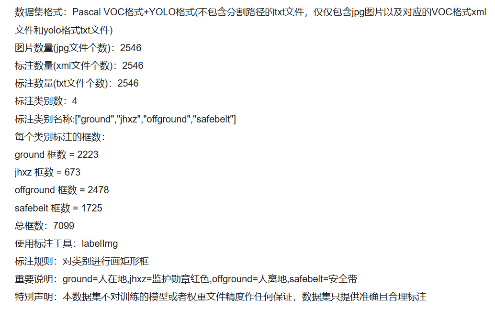
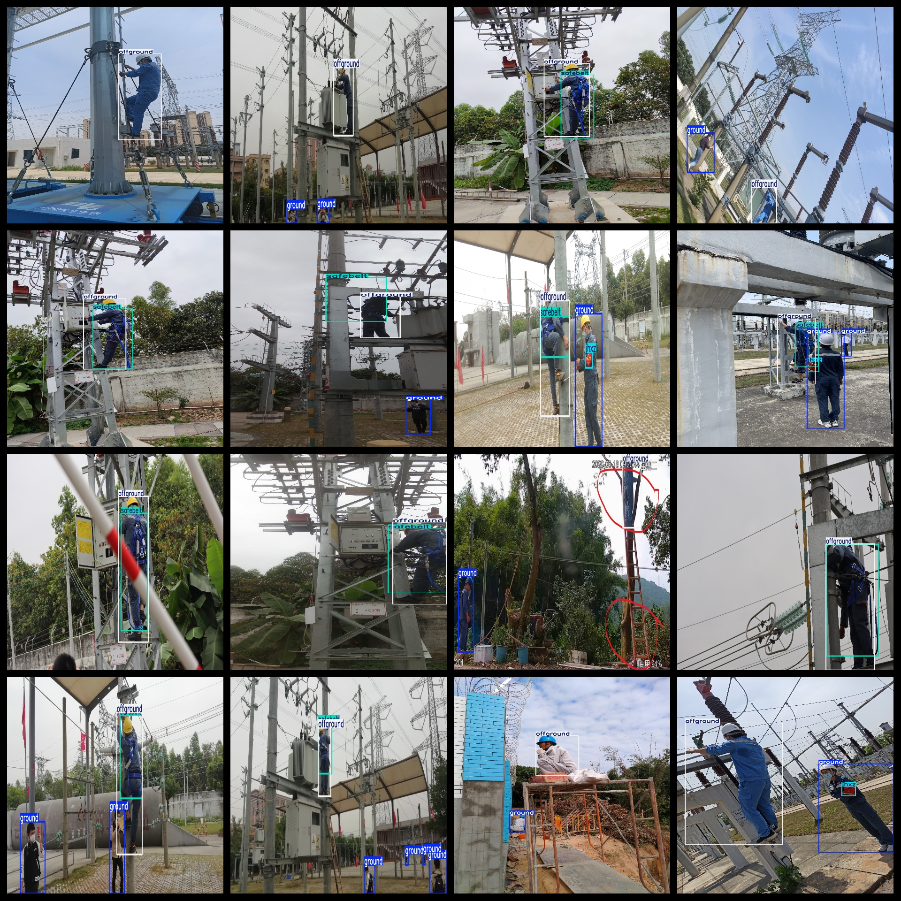
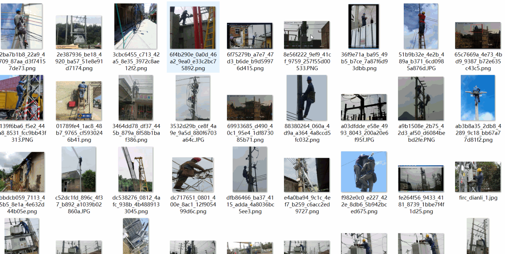

# [Object Detection Dataset] High-Altitude Operation and Safety Belt Wearing Detection Dataset 2546 images

Data set description:

The dataset is organized in Pascal VOC format combined with a YOLO format, without the splitting path of the txt file. It only includes the jpeg images along with their corresponding VOC format xml files and YOLO format txt files.

### Image Counts:

- Number of JPEG images: 2546

### Annotated Counts:

- Number of XML files: 2546

- Number of TXT files: 2546

### Annotation Categories:

- Number of categories: 4

- Category names: ["ground", "jhxz", "offground", "safebelt"]

Each category has its respective number of bounding box instances:

- ground: 2223

- jhxz: 673

- offground: 2478

- safebelt: 1725

Total bounding box instances: 7099

Using the labelImg tool for annotation:

Annotation rules: Draw rectangle boxes around the categories.

Important Notice: The ground = people on the ground, jhxz = guardian red, offground = person off the ground, safebelt = safety belt.

Special Remark: This dataset does not guarantee the accuracy or weights of any trained models or files; it provides accurate and reasonable annotations only.

Annotation Examples or Image Overview:
## Images

---

Here is a pay link on Stripe (https://buy.stripe.com/3cs8yP7sY87d0vu9AB). Please contact me lonlonago@foxmail.com after funding $89, and I will send you a complete data files, thank you!

